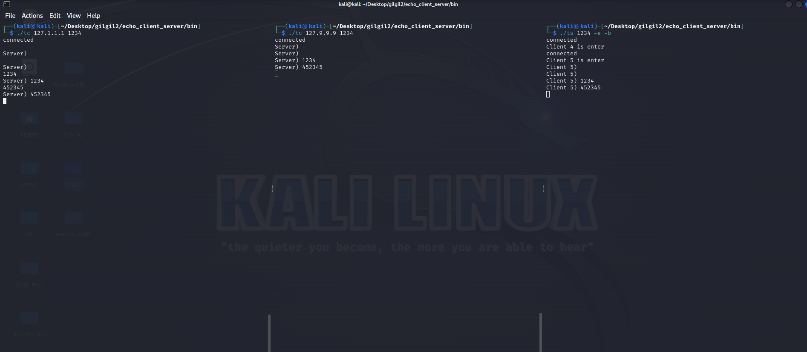

# echo_client_server
echo-client, echo-server

echo-client:  
syntax : echo-client <ip> <port>
sample : echo-client 192.168.10.2 1234

echo-server:
syntax : echo-server <port> [-e[-b]]
sample : echo-server 1234 -e -b
  
클라이언트를 관리할떄 현재 vector을 사용했는데 이렇게 삽입, 삭제가 빈번하게 일어나는 경우에는 굉장히 성능이 안좋다.  
그래서 이런 경우에는 std::list를 사용한다.  
근데 또 std::list인 경우에는 내부적으로 정렬이 안되어있어서 탐색할때 선형탐색을 사용. -> 성능 굉장히 안좋음  
  
따라서 이런경우 탐색시 이진탐색을 사용하는 set,map중 하나를 선택해서 사용, 여기서는 value가 필요없으므로 set을 사용하자  

Preview)  
